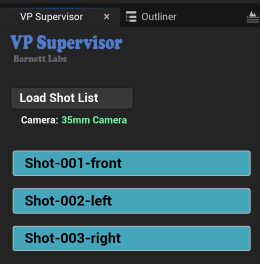

# VP Supervisor - Editor Utility Widget

This Unreal Engine Editor Utility Widget will help you:
 - Set up shot positions for your nDisplay and quickly move the NDC to those positions
 - For scenes with many identical static meshes - convert them to a Hierarchical Static Mesh

To install this widget into your Unreal Project:

 - TBD

Using the widget in UE5:
  * Find the widget, right-click, choose “Run VP Supervisor”  
  * Drag window tab next to Outliner for easy access  
* Setup your level:  
  * Make sure the NDC object is in your level (as a sublevel or anywhere)  
  * For each shot in your list: add an actor (or cinecamera), then add the tag “shotlist” to each of them.    
  * Give them useful names (e.g. “2A-park-alex\_intro”)  
* Using the Widget:  
  * Click the “Load Shot List” button in the widget  
    * It will find the NDC object and load in the shot list buttons  
  * Click any shot list button to move the NDC to that actor’s transform position  
    * Should update Render PCs too, but if not: try moving the NDC position slightly to update it
